# Comparison of GitLab and GitHub

## Introduction

Hello, my name is Ivan Gromakovskii, I am a software developer at Serokell.
I've been working on several relatively big projects during the last few years and I am one of the most significant contributors there.
Those projects include:
* [cardano-sl](https://github.com/input-output-hk/cardano-sl)
* [ariadne](https://github.com/serokell/ariadne)
* [morley](https://gitlab.com/morley-framework/morley)

Two of them are hosted on GitHub and one is hosted on GitLab.
I've been working on some other projects hosted on these platforms as well.
These two platforms are among the most popular ones for Git repositories, and in this article, I want to compare them based on my experience.
It should help people who are choosing between GitLab and GitHub for their new project or who consider switching from one platform to another.
In general, all people who use GitLab or GitHub may discover some new features here.

Disclaimer: both GitHub and GitLab are actively developed and new features appear there from time to time.
If some feature is present in only one platform, there are high chances it will be added to the other one at some point.
So this comparison will inevitably become somewhat outdated sooner or later.

## Our workflow

Let me briefly describe the way we write code and work with Git.
* We have the main integration branch which is protected so that all code gets there via Pull Requests (PRs).
Note: in GitLab, they are called Merge Requests (MR), I will be using "PR" for the rest of the article which means "MR" in the case of GitLab.
* Usually we have CI which at least checks that code compiles and tests pass.
It may perform other checks as well (e. g. correctness of links in the documentation).
* Apart from that, all PRs must be reviewed by other developers.
* A pull request can be merged only if all CI checks pass in the corresponding branch and if it is approved by a certain number of people (minimal number of approvals is usually 1 or 2).
* We _usually_ do not use the built-in issue tracker from GitLab or GitLab because we use a more advanced issue tracker.
Some repositories do use it though.
We also do not use features such as wiki.

Therefore, we are primarily interested in two things:
* Browsing a repository.
Even though it all can be done from one's editor, terminal, file manager and so on, sometimes one may want to do it from browser for various reasons.
* Pull requests: creation, code review, making and tracking changes, CI.

## Comparison

Comparison is split into 4 parts:
1. We start with the most basic features one can use when they browse repositories.
2. We compare the features and convenience of working with pull requests.
3. We proceed to additional free features and everything that does not fit into other parts.
4. We look at additional paid features and pricing.

I will not compare the design of these platforms because it is a very subjective thing and I am not competent to compare web designs anyway.
I will cover only features and UX.

### Browsing

Let's open some file on GitLab and GitHub.

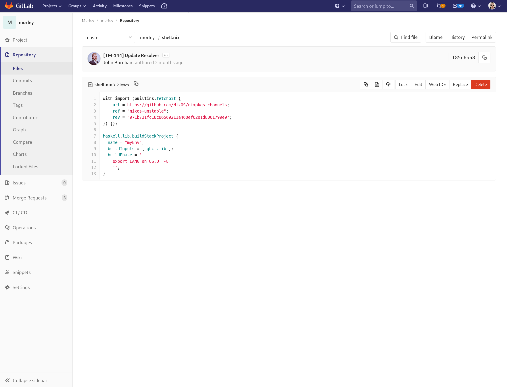

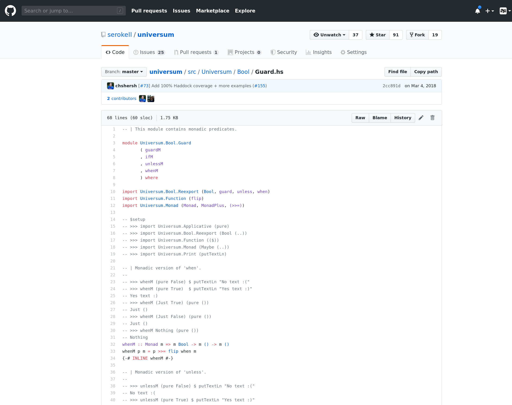

Both platforms offer some fundamental features including:
* Syntax highlighting.
It seems to work reasonably well on both platforms.
If you use tabs in your code, they will usually be shown as 8 spaces, which might be too much.
GitHub supports [EditorConfig](https://editorconfig.org/), which among other things allows you to specify how tabs will be displayed.
* Opening a raw file, blame (see `git blame`), history (commits which modify a given file).
* Some capabilities to edit or delete a file directly in a browser.
Those are not really useful for developers as we usually prefer editing files stored on our machines and committing changes using locally installed `git`.
For some people it might be convenient to edit files in a browser, but it is just not powerful enough.
For instance, you can't edit more than 1 file in one commit, can't sign commits, run pre-commit Git Hooks.
* Searching by filename or for occurrences of a certain string in source files.
* Getting a permalink to a file (which refers to a particular commit).
In both cases, it can be done using the `y` hotkey which might be hard to discover.
The way I learnt about it is that someone just told me.
GitLab has a button in UI to do it which should be useful for those not familiar with `y`.
I find this feature very useful and wish that people were using it more often.
In practice, people often send a link to a file bound to a particular branch rather than code revision and it refers to a completely different or non-existing place after a while.
* Getting a link to a particular line or a range of lines.
In order to do it, click on the line number.
If you hold `Shift` and click on another line, the range of lines between these two will be selected.

And here are some differences:
* GitLab also has a "Copy source to clipboard" button which could be useful to me, but from my experience, it often doesn't copy whitespaces correctly, so I do not use it.
For example, if I copy the file from the first screenshot, I get this:
```

with import (builtins.fetchGit {     url = https://github.com/NixOS/nixpkgs-channels;     ref = "nixos-unstable";     rev = "971b731fc18c86569211a460ef62e1d8001799e9"; }) {}; haskell.lib.buildStackProject {   name = "myEnv";   buildInputs = [ ghc zlib ];   buildPhase = ''     export LANG=en_US.UTF-8     ''; }

```
* If I press `y`, GitLab will reload the page and this reload is not instant.
On the other hand, GitHub only changes the URL in my browser without reloading anything, it happens instantly.
* Getting a permalink in GitHub is possible not only for files but also for folders.
In GitLab, it works only for files.
For folders, one can construct a permalink only manually.
* GitHub shows the contributors to a file, GitLab does not.
I don't find it useful, but maybe someone does.

Apart from viewing files and folders, we may want to look at commits.
Let's open lists of commits from `master` in some repos:

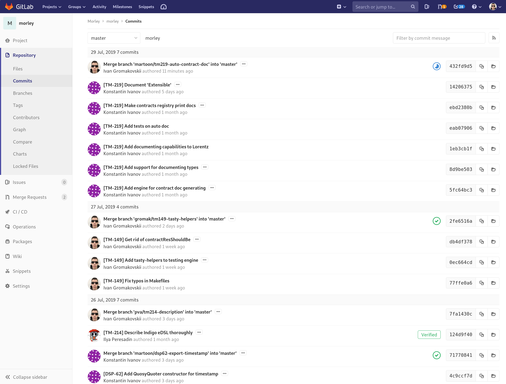

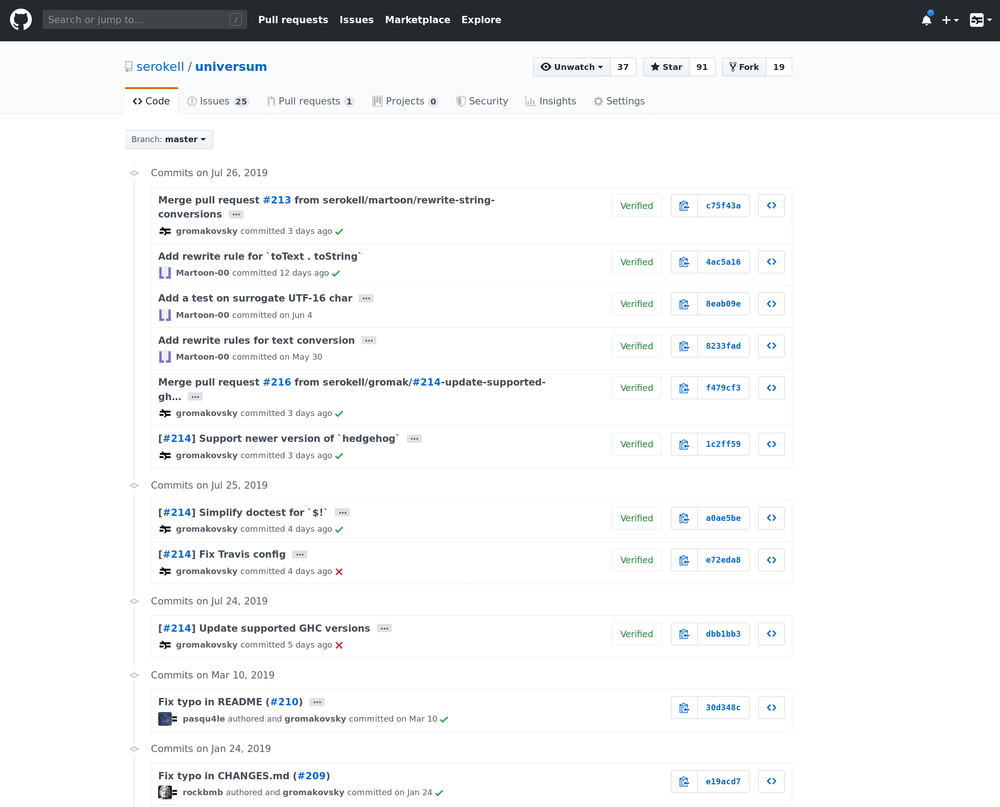

They look very similar, you can see which commits are signed with verified signatures, copy identifiers, browse files at some revision, choose another branch.

The only difference is that GitLab makes it easy to filter commits by the commit message.
I couldn't find such a feature on GitHub (you can use repository-wide search and select "Commits" category there, but it's less convenient).

Now let's see how commits are displayed.

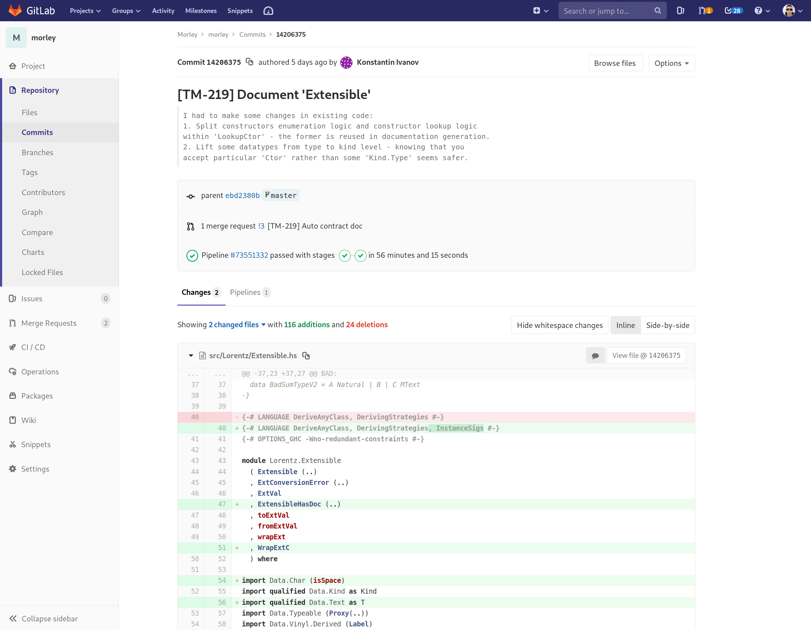

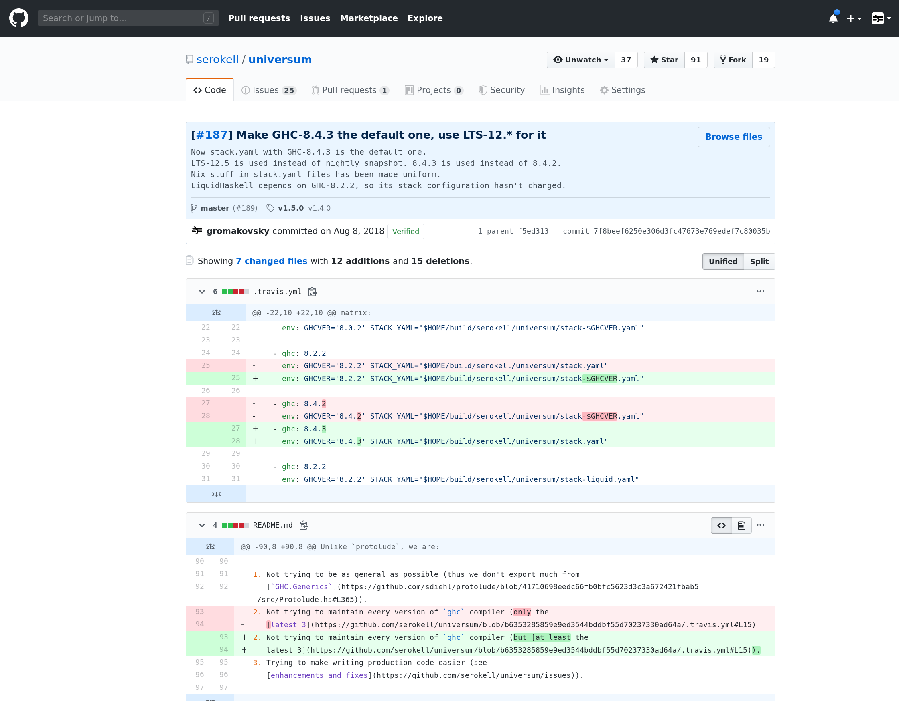

In both cases, you can switch between "Inline" and "Side-by-side" view ("Unified" vs "Split" in case of GitHub).
You can open the whole repository or a particular file at a given commit.
You can see the total number of changed files and lines.
You can leave a comment at some line or the whole commit.

There is one cool feature that not everyone is aware of and the only difference I've discovered is related to it.
If you add `?w=1` to the commit's URL, whitespace changes will be ignored.
GitLab has a button in UI to do it, but I couldn't find such a button in GitHub.

Finally, I can't but mention that both platforms have a variety of hotkeys helpful for browsing and navigation.
In particular:
* `t` to search for a file.
* Aforementioned `y` to expand URL to its canonical form.
* `l` to jump to a line (GitHub only).
* `gp` to go to Pull Requests on GitLab and `Shift-M` for GitLab.
* `s` or `/` to go to the global search.
* `?` opens a list of shortcuts.

Full lists of hotkeys can be found here:
* https://docs.gitlab.com/ee/workflow/shortcuts.html
* https://help.github.com/en/articles/keyboard-shortcuts

I do not actively use all these hotkeys, just a few ones, so it is hard to say who is the winner here.
GitHub seems to have more hotkeys, but the most useful ones seem to be present on both platforms.

### Pull requests

Let's open random pull requests on GitHub and GitLab.


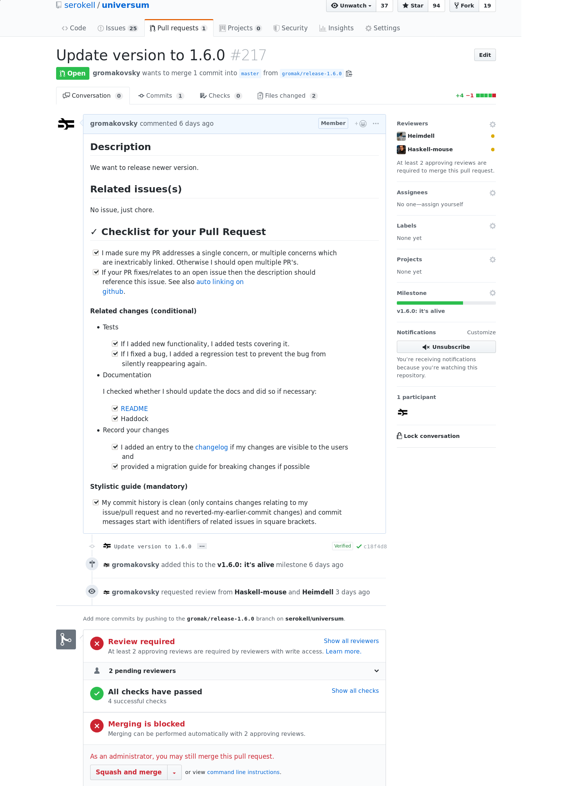

We can already see many features present in both cases.
The visible differences are mostly in design and I will not cover them here.
However, when we go deeper I will write about various differences.
Here are the common features:
1. Obviously, PRs have an author, a description, a branch in which changes are made and a target branch.
They can be in Open, Closed and Merged states.
2. There is a feed of all changes which happen to PR.
Users can write comments which will be interleaved with this feed.
3. The name of the PR branch can be copied.
It is useful if you want to clone the branch locally.
4. The status of pipelines/checks is displayed.
That's very useful for us because we actively use CI in virtually all our repositories to check that our code compiles and works.
5. It is possible to set "assignees" for PRs.
In GitHub, you can also set "reviewers".
The semantics of "reviewers" is pretty clear, while the semantics of "assignees" is a bit obscure to me — usually the person who opens a PR is its assignee.
6. It is possible to subscribe/unsubscribe to/from PRs.
7. There are other features that are less useful from my experience, such as labels, locking (to disable comments), milestones, etc.

So far, we have seen only the main page of each PR.
There are 3 more tabs: commits, pipelines/checks, and changes.
Let's have a look at them.

Tabs with commits are very similar:

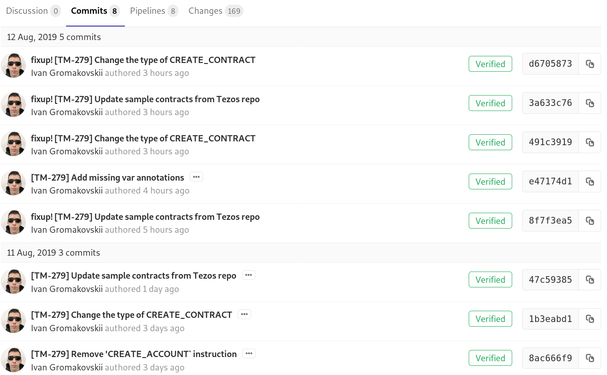


GitHub has a button to browse the repository at a certain commit and displays CI status for each commit for which it was run.
Also, GitHub shows the oldest commits first while GitLab shows the newest first.
It is slightly inconvenient when you work with both platforms.

Personally, I (almost) never use `Checks` and `Pipelines` tabs, so I won't write about them in this post.
Let's proceed to the `Changes` tab where most of the code review happens.

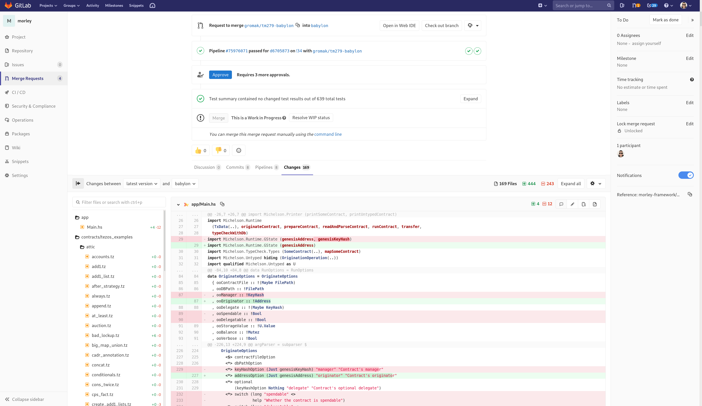

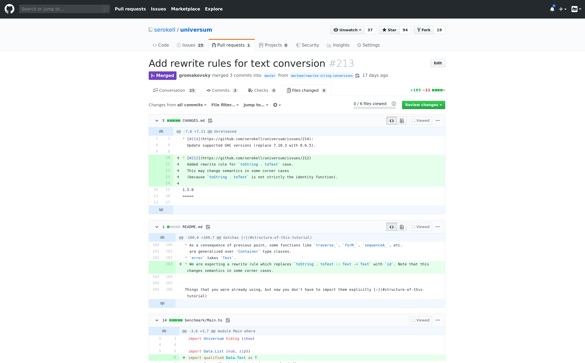

We can see a cool feature of GitLab: file browser.
It shows a tree of the changed files (you can change it to show a flat list instead) and the number of changes in each of them.
For me, this feature is very useful.

Even though I do not want to talk about design in this post because it is a subjective thing, I can't but mention one design difference because it affects usability.
As you can see, in GitHub changes occupy the whole width of the space that the browser gives to the webpage.
While in GitLab there are other elements: on the left, there is a column with buttons to open Issues, main repository page, etc.
Then there is a file manager and on the right, there is another column with buttons specific to the current PR.
It may cause inconvenience on narrow screens.
For example:

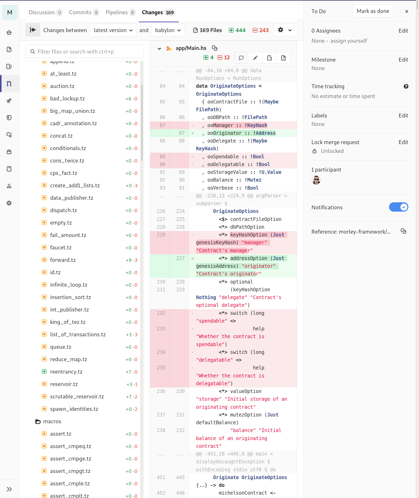

In such a case, it's almost impossible to review anything.
Fortunately, it is possible to collapse the file browser and the right column.
The left column is collapsed automatically if necessary.

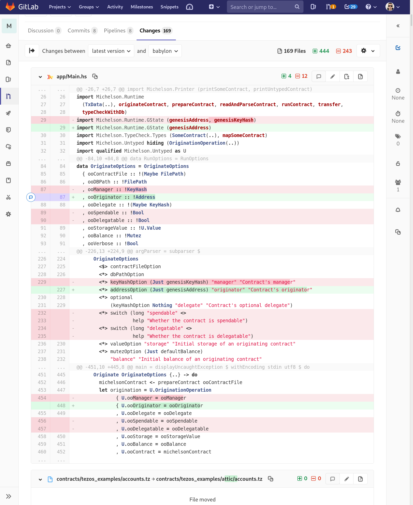

If you collapse everything, the changes will be reviewable.
So I would say that GitLab provides the better experience on wide monitors, while on narrow monitors it's almost the same except that you have to manually collapse some elements.

Let's list the basic features of the "Changes" tab common for both platforms:
* Of course it is possible to comment any particular line.
* It is possible to review changes from a particular commit rather than from the whole PR.
* For each file, it is possible to copy its name and open this file at the revision that is being reviewed.
* When you leave a comment you can suggest changes directly, that is, essentially, provide a diff in your comment.

Now that we have seen all the tabs, let's proceed to details and compare particular features related to pull requests:
1. In GitHub, it is very easy and convenient to request a review from somebody.
Moreover, you can request it again, for instance, if someone requested certain changes and you have made them.
GitLab apparently does not have this straightforward notion of reviewers and requests for review.
It is possible to add approval rules there: e. g. require that `n` people out of a certain set of people approve the PR in question.
It seems to be more complicated and inconvenient for day-to-day usage, at least in our workflow.
Alternatively, you can use the `Assignee` field to request a review.

2. It is often the case that your PR's branch is behind the target branch, i. e. does not have some commits present in the target branch.
There is a setting that prevents PRs from being merged if they are behind the target branch and we usually enable it.
GitLab shows how far (i. e. by how many commits) your branch is behind the target branch.
It also allows you to rebase your branch onto the target branch.
GitLab, on the other hand, allows you to merge the target branch into your branch and displays conflicting files if there are any.
Of course, neither rebase nor merge are possible if there are conflicts (there are some capabilities to resolve conflicts in a browser, but I guess an average developer will prefer doing it in their local repository).
Here is how it looks in GitLab:

  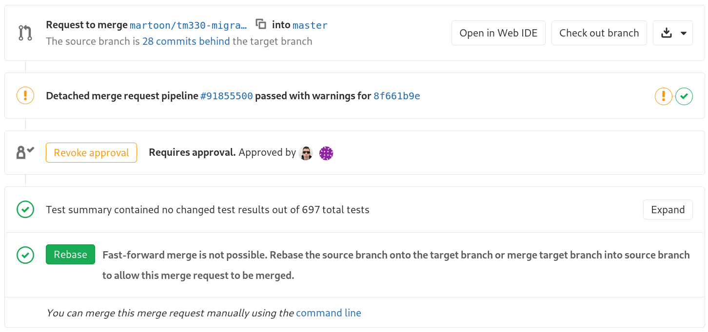

  And in GitHub:

  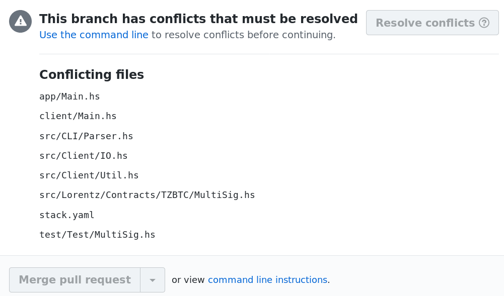

3. GitLab has an amazing button to automatically merge PR when all required checks pass.
It is often the case that your PR is approved, you make some final fixes and then you have to wait for CI to pass before you can merge it.
This button allows you to set automatic merging and close the tab without having to wait for CI.


4. Another GitLab feature is self-approval.
When enabled, it allows you to approve PRs created by you.
It is useful in some cases.
For instance, if you create a PR from a branch where someone else was working.
Or if you started some work, made a PR, but then someone else finished your work.
It also makes it more clear whether the author thinks that all the work is done, though for this purpose setting Draft/WIP status is more natural.

5. Speaking of Draft/WIP status, there is a difference as well.
Both platforms allow you to explicitly say that your PR is not ready to be merged.
In GitHub, you can create a "Draft" PR, and in GitLab, you can start the tittle with `WIP` prefix.
The essential difference is that `WIP` status can be added and removed at any time, while Draft status can only be changed from Draft to Ready, but not in the opposite direction.
I. e. if a PR is not a Draft, it can not be changed to Draft.

6. GitHub allows you to approve a PR or explicitly "reject it" (request changes).
The latter prevents it from being merged.
In GitLab, you can only explicitly approve, but not explicitly reject.
You can reject by writing something in comments, but it won't disable merging.

7. GitHub recently introduced a new feature which allows you to mark changed files as viewed and keep track of viewed files.

  

8. There is a difference in depth of comments.
In GitLab, it is possible to reply to a PR comment, thus starting a thread under that comment.
In GitHub, on the other hand, PR comments are linear.
It applies only to comments to PR itself, not to a particular line.
Each comment to a particular line naturally starts a new thread.


9. On both platforms PR discussions can be marked as resolved.
An advantage of GitLab is that it keeps track of all discussions and shows how many of them are resolved/unresolved.
It is useful for PRs with many discussions where it's hard to find out how many discussions are still relevant.


10. Under the hood, PR information generated by GitHub is static HTML, while GitLab loads its information with JavaScript as you go.

11. Last item is about a relatively new feature of GitHub: multiline comments.
When you review changes in a PR, you can select multiple lines and leave a comment for all of them.
Note that it is possible only in a PR, but not for a commit outside of any PR.

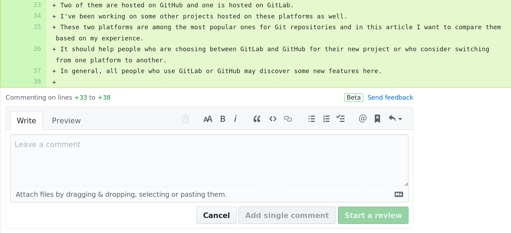

### Additional features

One of the biggest and most important features of GitLab that has not been mentioned yet and is not present in GitHub is the integrated CI/CD system.
There are many free CI systems that one can easily setup for their GitHub repositories, but using an out-of-box solution is usually more convenient.
You don't have to depend on another service and open another website in your browser to get the details of a build.

GitLab has a container registry, so you can have CI build your software and put it into this registry.
After that, one can pull it using Docker and use on their machine.

Another feature is [file locking](https://docs.gitlab.com/ee/user/project/file_lock.html).
It allows you to prevent some file or directory from being modified.

Apart from features, I want to point out that I was getting error code 500 and some other errors from GitLab several times.
Also, sometimes there was weird behavior by GitLab where it didn't allow us to merge a PR even when all preconditions (pipelines, approvals, etc.) were satisfied.
Sometimes it was sufficient to force push to the PR branch, in other cases the only solution was to recreate the same PR.
I don't recall internal errors from GitHub (perhaps I encountered one or two, but that is a very rare case).
So, GitHub seems to work more reliably lately (but maybe we are just lucky).

### Paid features and pricing

Both GitLab and GitHub offer most of their features for free and have paid plans for those who need more.
Here is a brief overview of what you may get if you pay.

Let's start with GitLab, this table provides a brief summary of what you can get for which price:


The only important feature that is not available for free is PR approvals.
In our workflow, we require PR to be approved before it can be merged.
There is one cool thing not mentioned there: "public projects are considered to have a Gold subscription level".
Even with the Gold subscription level available in public projects, I think I haven't used anything else (beside approvals) that is not freely available.
If you are interested in an in-depth feature comparison, you can find it [here](https://about.gitlab.com/pricing/gitlab-com/feature-comparison/).

GitHub offers different plans for individuals and teams.
In all cases, you get unlimited public and private repositories just like on GitLab.
Here is a summary of GitHub plans:

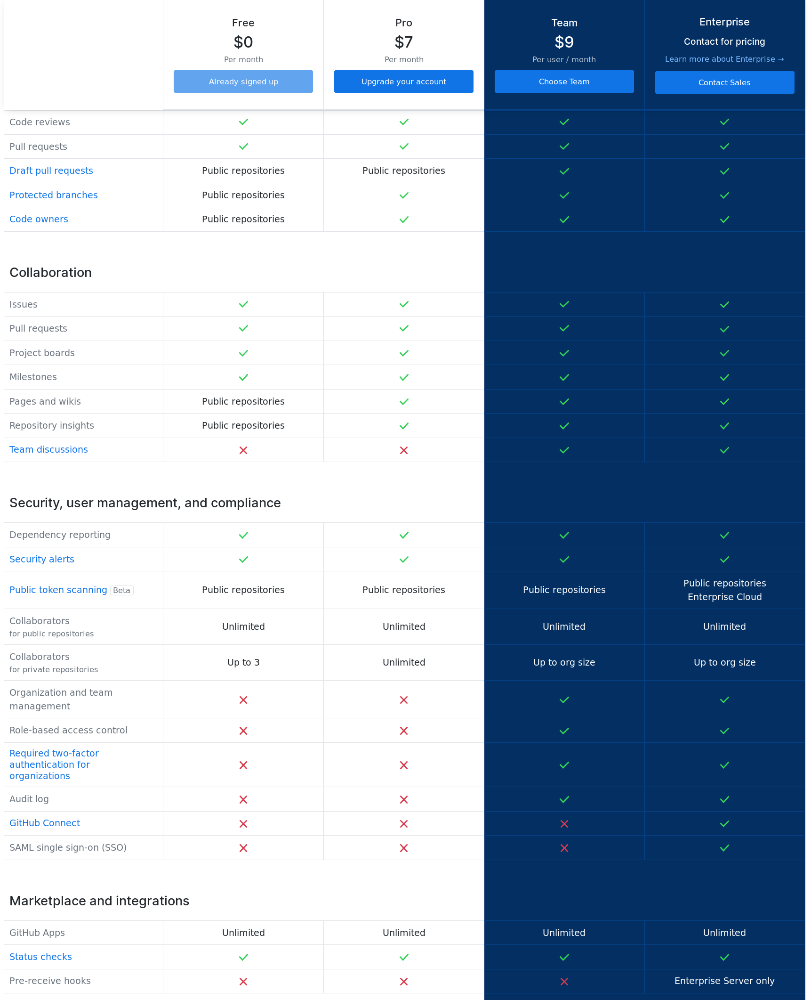

Looking at this table, one may think that there is no way to have an organization on GitHub for free.
However, if you try to create a new organization, you will see that there is "Team For Open Source" option which is free.

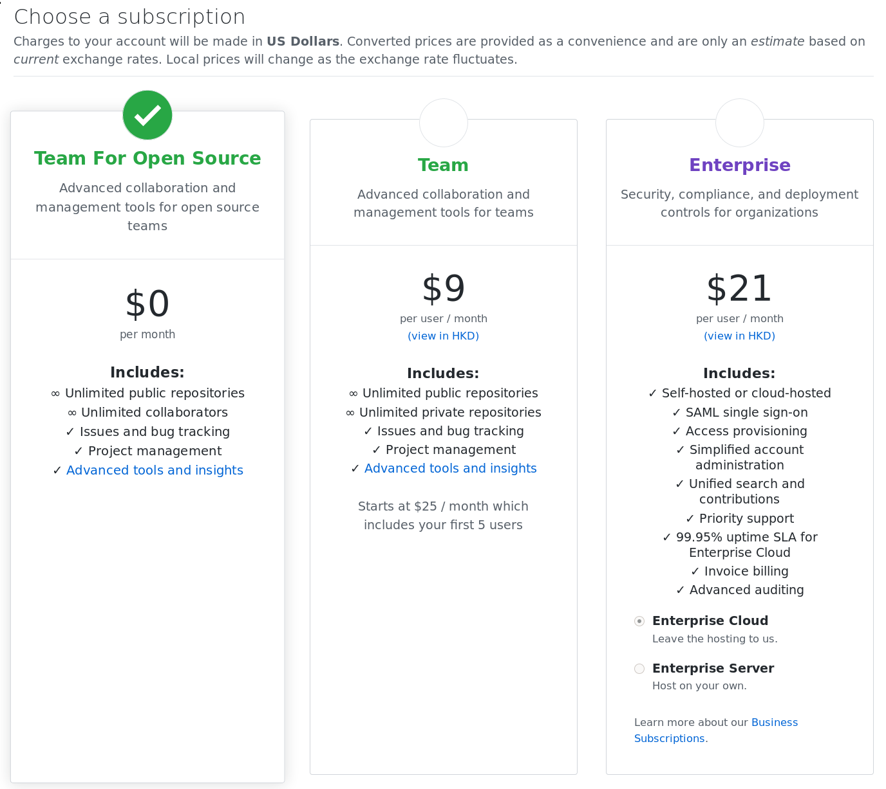

As you can see, this option allows you to create only public repositories.
Apart from that, it seems to be the same as "Team" which costs $9 per user per month.

Here is a short comparison:
* For personal needs a free plan will most certainly be sufficient on both plaftforms.
The only case I can imagine when one may want to have a paid plan for individuals is when they have a relatively big and important private repository with multiple collaborators.
  * In case of GitHub, you will pay $7/month and will get protected branches and code owners in private repositories.
  * In case of GitLab, you will pay $4/month for Bronze and will get approvals in private repositories.
* For organizations that need only public repositories, free plans are sufficient.
* If your organization needs private repositories:
  * In case of GitHub, you will pay $9/month for each user unless you need something offered by the Enterprise plan. In most cases, the "Team" plan should be enough.
  * In case of GitLab, you can even pay nothing and have unlimited private repositories and unlimited collaborators. I've been working with a private repository on the free plan and the only feature I really miss is merge approvals. If you pay $4 per user per month, you will get this feature and some other benefits. There are two more expensive plans that I do not consider in this article.

## Conclusion

In this article, I have compared two platforms for hosting Git repositories which are very popular nowadays: GitLab and GitHub.
In general, they offer similar sets of features, but there are various differences if one pays attention to details.
Both have some pros and cons.
I would like to finish this article with a table which summarizes the advantages of the platforms:

| GitLab | GitHub |
| ------ | ------ |
| A button to merge a PR when CI passes | More natural way to request a review, ability to re-request it. |
| Shows how far your branch is behind the target branch and allows to rebase on it | Shows conflicting files and allows to merge the target branch |
| Reply to PR comments (start a discussion/thread under a comment) | Multiline comments |
| UI buttons to hide whitespace changes and get permalinks (easy to find, unlike hotkeys) | Getting a permalink is instant and works for folders |
| Shows the number of resolved discussions | Allows to mark files as viewed |
| Cheaper unless you want something very advanced | Subjectively more stable and reliable |
| UI to filter commits | |
| File browser | |
| Own CI and CD | |

Of course, there are other features and differences omitted in this post simply because I do not use them or do not even know about them.
However, I have tried to cover functionality that is most commonly used by developers.
If you are in doubts about which platform to choose, hopefully this article will help you make the choice.
